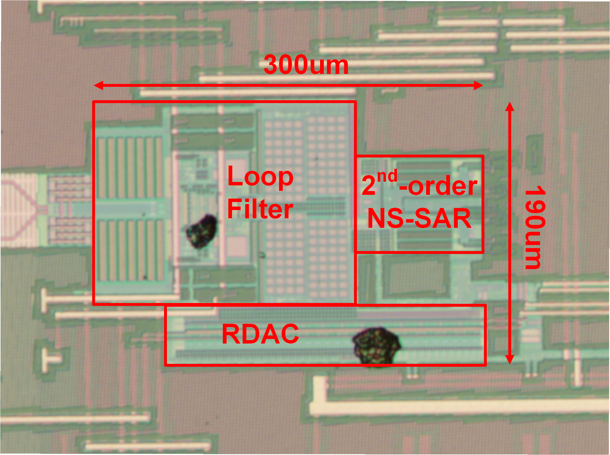


  You can also find my articles on <u><a href="{{author.googlescholar}}">my Google Scholar profile</a>.</u>




Conference Papers
======
* 2021
  ### A 3.7 mW 12.5 MHz 81dB-SNDR 4th-Order CTDSM with Single-OTA and 2nd-Order NS-SAR
   * **Wei Shi**, Jiaxin Liu, Abhishek Mukherjee, Xiangxing Yang, Xiyuan Tang, Linxiao Shen, Wenda Zhao, Nan Sun
   * IEEE International Solid-State Circuits Conference (ISSCC), Feb. 13-22, 2021.  
     
     
  ### A 0.4-to-40MS/s 75.7 dB-SNDR Fully Dynamic Event-Driven Pipelined ADC with 3-Stage Cascoded Floating Inverter Amplifier
   * Xiyuan Tang, Xiangxing Yang, Jiaxin Liu, **Wei Shi**, David Z Pan, Nan Sun
   * IEEE International Solid-State Circuits Conference (ISSCC), Feb. 13-22, 2021.  

  ### A 79dB-SNDR 167dB-FoM Bandpass ΔΣ ADC Combining N-Path Filter with Noise-Shaping SAR
   * Linxiao Shen, Zijie Gao, Xiangxing Yang, **Wei Shi**, Nan Sun
   * IEEE International Solid-State Circuits Conference (ISSCC), Feb. 13-22, 2021.  

* 2020
  ### Closing the design loop: Bayesian optimization assisted hierarchical analog layout synthesis
   * Mingjie Liu, Keren Zhu, Xiyuan Tang, Biying Xu, **Wei Shi**, Nan Sun, David Z Pan
   * ACM/IEEE Design Automation Conference (DAC), Jul. 20-24, 2020.  

  ### A 13.5 b-ENOB second-order noise-shaping SAR with PVT-robust closed-loop dynamic amplifier
   * Xiyuan Tang, Xiangxing Yang, Wenda Zhao, Chen-Kai Hsu, Jiaxin Liu, Linxiao Shen, Abhishek Mukherjee, **Wei Shi**, David Z Pan, Nan Sun
   * IEEE International Solid-State Circuits Conference (ISSCC), Feb. 16-20, 2020.  
  
  ### A 0.01mm2 25µW 2MS/s 74dB-SNDR Continuous-Time Pipelined-SAR ADC with 120fF Input Capacitor
   * Linxiao Shen, Yi Shen, Xiyuan Tang, Chen-Kai Hsu, **Wei Shi**, Shaolan Li, Wenda Zhao, Abhishek Mukherjee, Nan Sun
   * IEEE International Solid-State Circuits Conference (ISSCC), Feb. 17-21, 2019.  

Journal Papers
======
### An Efficient Analog Circuit Sizing Method Based on Machine Learning Assisted Global Optimization
   * Xiyuan Tang, Xiangxing Yang, Jiaxin Liu, **Wei Shi**, David Z Pan, Nan Sun
   * IEEE Transactions on Computer-Aided Design of Integrated Circuits and Systems, May., 2021.  

### A 13.5-ENOB, 107-μW noise-shaping SAR ADC with PVT-robust closed-loop dynamic amplifier
   * Xiyuan Tang, Xiangxing Yang, Wenda Zhao, Chen-Kai Hsu, Jiaxin Liu, Linxiao Shen, Abhishek Mukherjee, **Wei Shi**, Shaolan Li, David Z Pan, Nan Sun
   * IEEE Journal of Solid-State Circuits, Sep., 2020.  

### An energy-efficient comparator with dynamic floating inverter amplifier
   * Xiyuan Tang, Linxiao Shen, Begum Kasap, Xiangxing Yang, **Wei Shi**, Abhishek Mukherjee, David Z Pan, Nan Sun
   * IEEE Journal of Solid-State Circuits, Jan., 2020.  

### An energy-efficient comparator with dynamic floating inverter amplifier
   * Linxiao Shen, Yi Shen, Zhelu Li, **Wei Shi**, Xiyuan Tang, Shaolan Li, Wenda Zhao, Mantian Zhang, Zhangming Zhu, Nan Sun
   * IEEE Journal of Solid-State Circuits, Aug., 2029.  
