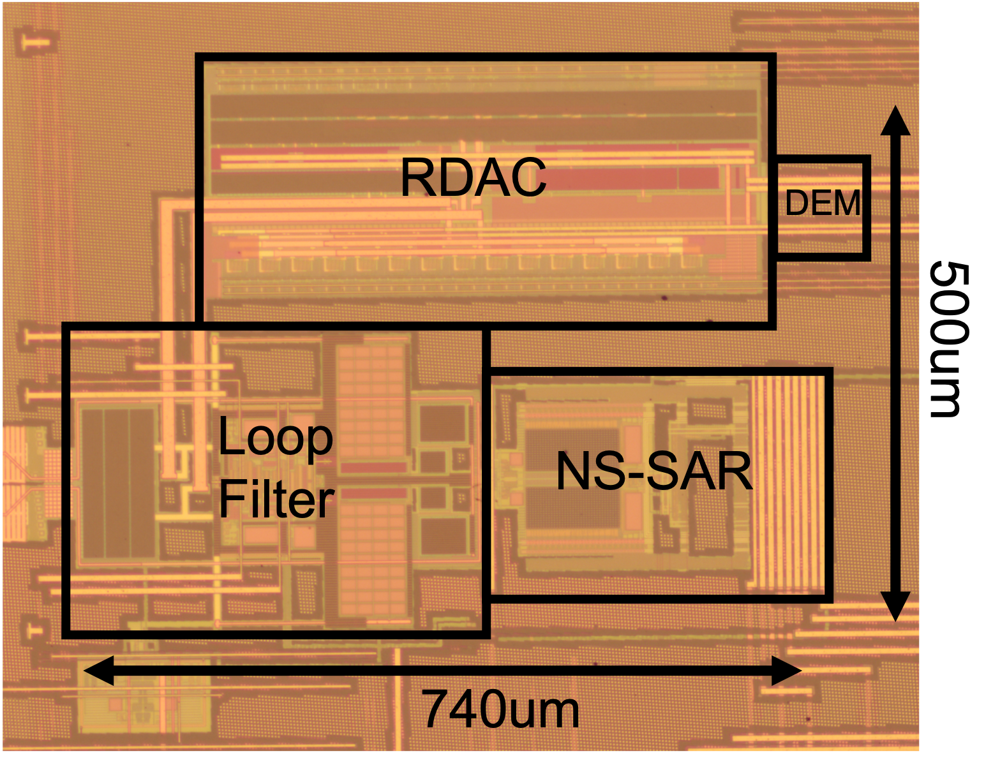
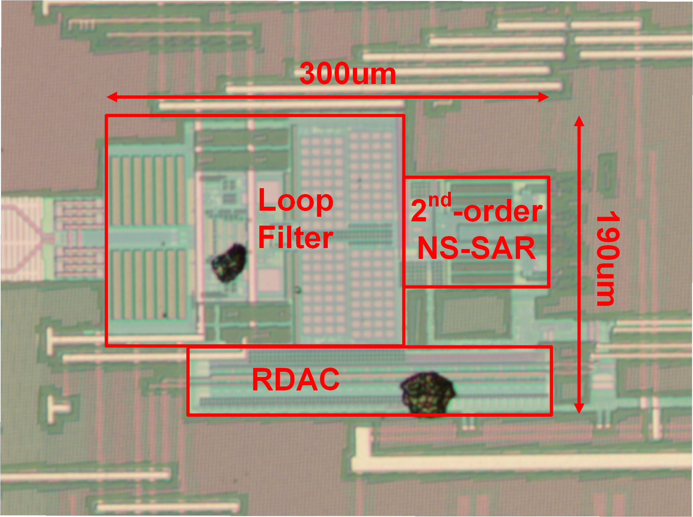


  You can also find my articles on <u><a href="{{author.googlescholar}}">my Google Scholar profile</a>.</u>




Conference Papers
======
* 2025
  ### MOTTO: A Mixture-of-Experts Framework for Multi-Treatment, Multi-Outcome Treatment Effect Estimation
   * Y. Liu\*, **Wei Shi**\*, C. Fu, Z. Jiang, Z. Hua, D. Carlson (\*Equal contribution)
   * ACM SIGKDD Conference on Knowledge Discovery and Data Mining (KDD), 2025.

  ### Session-Level Dynamic Ad Load Optimization using Offline Robust Reinforcement Learning
   * T. Liu, Q. Xu, **Wei Shi**, Z. Hua, S. Yang
   * ACM SIGKDD Conference on Knowledge Discovery and Data Mining (KDD), 2025.

* 2024
  ### 33.9 A Miniature Neural Interface Implant with a 95% Charging Efficiency Optical Stimulator and an 81.9 dB SNDR ΔΣM-Based Recording Frontend
   * L. Zhao, **Wei Shi**, Y. Gong, X. Liu, W. Li, Y. Jia
   * IEEE International Solid-State Circuits Conference (ISSCC), Feb. 2024.

  ### PVTSizing: A TuRBO-RL-Based Batch-Sampling Optimization Framework for PVT-Robust Analog Circuit Synthesis
   * Z. Kong, X. Tang, **Wei Shi**, Y. Du, Y. Lin, Y. Wang
   * ACM/IEEE Design Automation Conference (DAC), Jun. 2024.

  ### Ads Supply Personalization via Doubly Robust Learning
   * **Wei Shi**, C. Fu, Q. Xu, S. Chen, J. Zhang, Q. Zhu, Z. Hua, S. Yang
   * ACM International Conference on Information and Knowledge Management (CIKM), Oct. 2024.

* 2023
  ### A Wireless Implantable Opto-Electro Neural Interface ASIC for Simultaneous Neural Recording and Stimulation
   * L. Zhao, Y. Gong, **Wei Shi**, R. Stephany, W. Li, Y. Jia
   * IEEE Custom Integrated Circuits Conference (CICC), Apr. 2023.

* 2022
  ### RobustAnalog: Fast Variation-Aware Analog Circuit Design via Multi-Task RL
   * **Wei Shi**, H. Wang, J. Gu, M. Liu, D. Z. Pan, S. Han, N. Sun
   * ACM/IEEE Workshop on Machine Learning for CAD (MLCAD), Sep. 2022.

  ### A 0.37mm2 250kHz-BW 95dB-SNDR CTDSM with Low-Cost 2nd-order Vector-Quantizer DEM
   * **Wei Shi**\*, Xing Wang\*, Xiyuan Tang, Abhishek Mukherjee, Raviteja Theertham, Shanthi Pavan, Lu Jie, Nan Sun
   * IEEE Custom Integrated Circuits Conference (CICC), April 24-27, 2022.
   

  ### Generative-Adversarial-Network-Guided  Well-Aware  Placement  for  Analog  Circuits
   * Keren Zhu, Hao Chen, Mingjie Liu, Xiyuan Tang, **Wei Shi**, Nan Sun, and David Z. Pan
   * IEEE/ACM  Asia  and  SouthPacific Design Automation Conference (ASPDAC), Virtual Conference, January 17-20, 2022.
   * Accepted

* 2021
  ### A 3.7 mW 12.5 MHz 81dB-SNDR 4th-Order CTDSM with Single-OTA and 2nd-Order NS-SAR
   * **Wei Shi**, Jiaxin Liu, Abhishek Mukherjee, Xiangxing Yang, Xiyuan Tang, Linxiao Shen, Wenda Zhao, Nan Sun
   * IEEE International Solid-State Circuits Conference (ISSCC), Feb. 13-22, 2021.  
     
     
  ### A 0.4-to-40MS/s 75.7 dB-SNDR Fully Dynamic Event-Driven Pipelined ADC with 3-Stage Cascoded Floating Inverter Amplifier
   * Xiyuan Tang, Xiangxing Yang, Jiaxin Liu, **Wei Shi**, David Z Pan, Nan Sun
   * IEEE International Solid-State Circuits Conference (ISSCC), Feb. 13-22, 2021.  

  ### A 79dB-SNDR 167dB-FoM Bandpass ΔΣ ADC Combining N-Path Filter with Noise-Shaping SAR
   * Linxiao Shen, Zijie Gao, Xiangxing Yang, **Wei Shi**, Nan Sun
   * IEEE International Solid-State Circuits Conference (ISSCC), Feb. 13-22, 2021.  

* 2020
  ### Closing the design loop: Bayesian optimization assisted hierarchical analog layout synthesis
   * Mingjie Liu, Keren Zhu, Xiyuan Tang, Biying Xu, **Wei Shi**, Nan Sun, David Z Pan
   * ACM/IEEE Design Automation Conference (DAC), Jul. 20-24, 2020.  

  ### A 13.5 b-ENOB second-order noise-shaping SAR with PVT-robust closed-loop dynamic amplifier
   * Xiyuan Tang, Xiangxing Yang, Wenda Zhao, Chen-Kai Hsu, Jiaxin Liu, Linxiao Shen, Abhishek Mukherjee, **Wei Shi**, David Z Pan, Nan Sun
   * IEEE International Solid-State Circuits Conference (ISSCC), Feb. 16-20, 2020.  
  
  ### A 0.01mm2 25µW 2MS/s 74dB-SNDR Continuous-Time Pipelined-SAR ADC with 120fF Input Capacitor
   * Linxiao Shen, Yi Shen, Xiyuan Tang, Chen-Kai Hsu, **Wei Shi**, Shaolan Li, Wenda Zhao, Abhishek Mukherjee, Nan Sun
   * IEEE International Solid-State Circuits Conference (ISSCC), Feb. 17-21, 2019.  

Journal Papers
======
### NeuroFlare: An mm3-Scale Wireless Neural Interface Device With Simultaneous Neural Recording and Optical Stimulation
   * L. Zhao, Y. Gong, X. Liu, **Wei Shi**, Y. Han, W. Li, Y. Jia
   * IEEE Journal of Solid-State Circuits (JSSC), Sep., 2025.  

### An Energy-Efficient and Artifact-Resilient ASIC for Simultaneous Neural Recording and Optogenetic Stimulation
   * L. Zhao, Y. Gong, R. G. Stephany, **Wei Shi**, W. Li, Y. Jia
   * IEEE Transactions on Biomedical Circuits and Systems (TBioCAS), Aug., 2024.  

### A Bandwidth-Adaptive Pipelined SAR ADC with Three-Stage Cascoded Floating Inverter Amplifier
   * Xiyuan Tang, Xiangxing Yang, Jiaxin Liu, Z. Wang, **Wei Shi**, David Z. Pan, Nan Sun
   * IEEE Journal of Solid-State Circuits (JSSC), Sep., 2023.  

### A 3.7-mW 12.5-MHz 81-dB SNDR 4th-Order Continuous-Time DSM with Single-OTA and 2nd-Order Noise-Shaping SAR
   * **Wei Shi**, Jiaxin Liu, Abhishek Mukherjee, Xiangxing Yang, Xiyuan Tang, Linxiao Shen, Wenda Zhao, Nan Sun
   * IEEE Open Journal of the Solid-State Circuits Society, 2022.  

### An Efficient Analog Circuit Sizing Method Based on Machine Learning Assisted Global Optimization
   * Ahmet Budak, Miguel Gandara, **Wei Shi**, David Pan, Nan Sun, Bo Liu
   * IEEE Transactions on Computer-Aided Design of Integrated Circuits and Systems, May., 2021.  

### A 13.5-ENOB, 107-μW noise-shaping SAR ADC with PVT-robust closed-loop dynamic amplifier
   * Xiyuan Tang, Xiangxing Yang, Wenda Zhao, Chen-Kai Hsu, Jiaxin Liu, Linxiao Shen, Abhishek Mukherjee, **Wei Shi**, Shaolan Li, David Z Pan, Nan Sun
   * IEEE Journal of Solid-State Circuits, Sep., 2020.  

### An energy-efficient comparator with dynamic floating inverter amplifier
   * Xiyuan Tang, Linxiao Shen, Begum Kasap, Xiangxing Yang, **Wei Shi**, Abhishek Mukherjee, David Z Pan, Nan Sun
   * IEEE Journal of Solid-State Circuits, Jan., 2020.  

### A two-step ADC with a continuous-time SAR-based first stage
   * Linxiao Shen, Yi Shen, Zhelu Li, **Wei Shi**, Xiyuan Tang, Shaolan Li, Wenda Zhao, Mantian Zhang, Zhangming Zhu, Nan Sun
   * IEEE Journal of Solid-State Circuits, Aug., 2019.  

Preprints
======
### Synergizing Deconfounding and Temporal Generalization For Time-series Counterfactual Outcome Estimation
   * Y. Liu, J. Dong, C. Fu, **Wei Shi**, Z. Jiang, Z. Hua, D. Carlson
   * arXiv preprint arXiv:2511.16006, 2025.  
